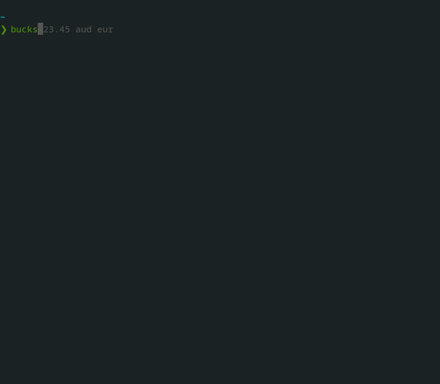

# 💵 Bucks 💵

A simple commandline currency converter written in Go.

## Demo


  
## Features

- Convert currencies easily
- Powered by third party APIs
  
### Limitations 

- it can only convert one currency at a time.
- only supports [CurrencyConvertApi](https://free.currencyconverterapi.com/)
## Installation

`bucks` requires the use of a configuration file. The standard location for this file is
`$HOME/.bucks.yaml` and is a `yaml` file.

Sign up for a free API key [here](https://free.currencyconverterapi.com/free-api-key). It takes 
two minutes. Then enter the key into the `key` field within `$HOME/.bucks.yaml`. 

You can copy the example `yaml` file found at the top level of this repo to your `$HOME` by running:

`mv bucks.example.yaml $HOME/.bucks.yaml`

```yaml
# bucks example configuration yaml
providers:
  currencyconverterapi:
    # API key from provider, empty means it will not be used even in fallback
    key: ""
    # set to true if this should be the preferred API.
    default: false
```
If `bucks` does not find this file it will fail to run. 

To get `bucks` running on your devie (I've only tested linux but mac and WSL should work too).
```bash
git clone https://github.com/danielmichaels/bucks
cd bucks
go install
```

**Note:** Better install/setup methods are a work in progress.

## Usage/Examples

After cloning the repo and running `go install`, `bucks` will available as an executable. Run it 
like so.

```shell
bucks 100 usd eur
```

The arguments read like this:

"I want to convert 100 USD into EUR" or "What is 100 AUD worth in USD".
  
## License

[Apache License 2.0](https://choosealicense.com/licenses/apache-2.0/)
  
## Related

Here are some related projects

- [cash-cli](https://github.com/xxczaki/cash-cli) written in Node
- [gocash](https://github.com/basebandit/gocash) another Go currency converter
  
## Contributing

Contributions are always welcome!

